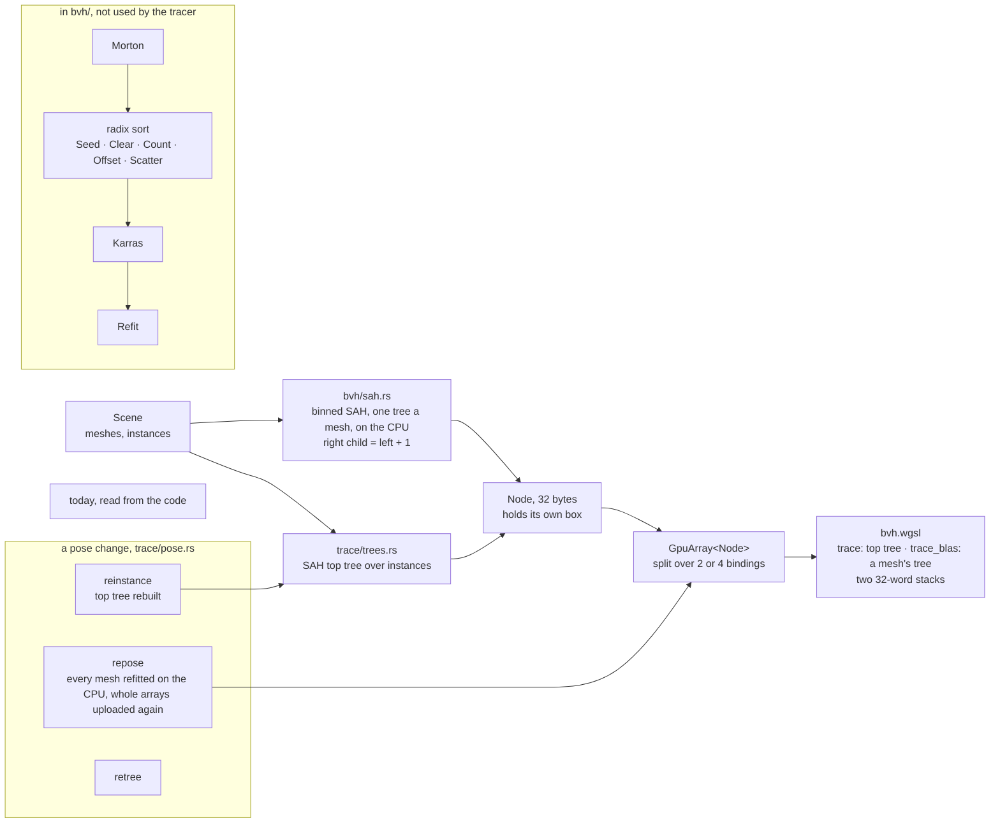
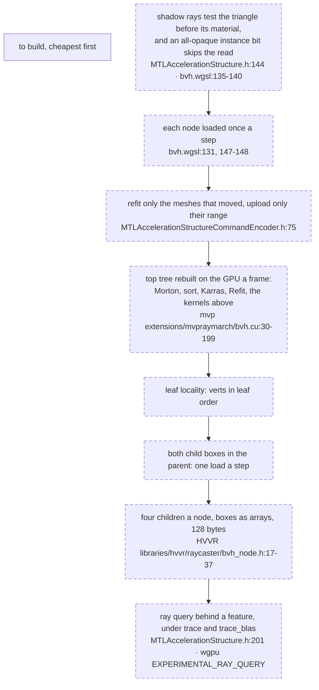
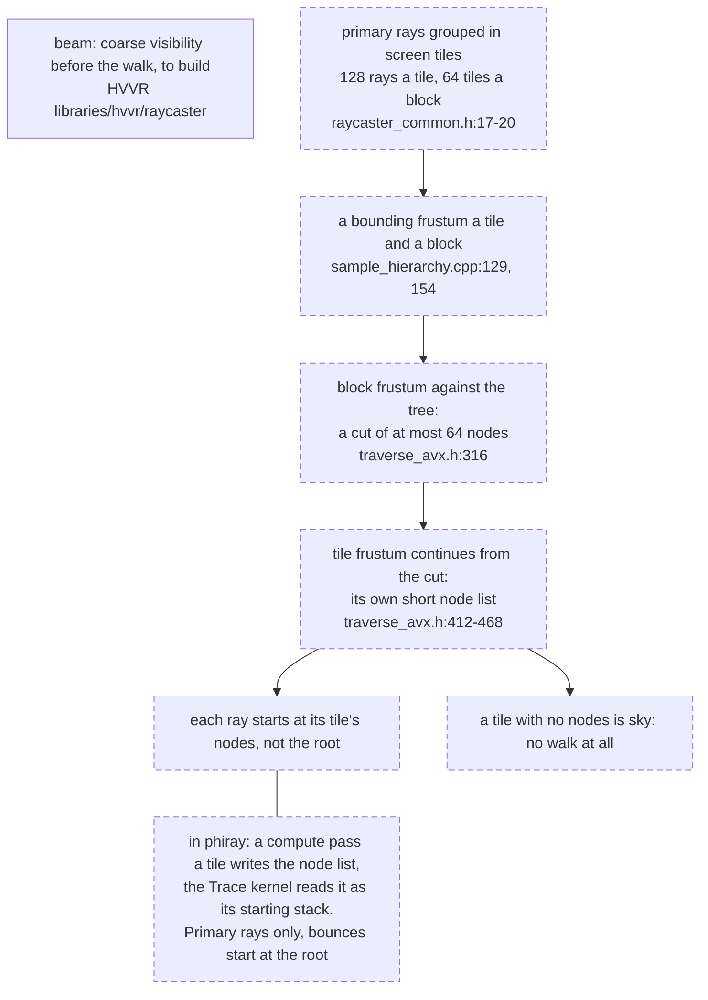

# accel

```mermaid
graph LR
    key["today, read from the code"]
    a_scene["Scene<br/>meshes, instances"]
    a_sah["bvh/sah.rs<br/>binned SAH, one tree a mesh, on the CPU<br/>right child = left + 1"]
    a_top["trace/trees.rs<br/>SAH top tree over instances"]
    a_node["Node, 32 bytes<br/>holds its own box"]
    a_up["GpuArray&lt;Node&gt;<br/>split over 2 or 4 bindings"]
    a_walk["bvh.wgsl<br/>trace: top tree · trace_blas: a mesh's tree<br/>two 32-word stacks"]
    a_scene --> a_sah --> a_node
    a_scene --> a_top --> a_node
    a_node --> a_up --> a_walk
    subgraph pose["a pose change, trace/pose.rs"]
        p_repose["repose<br/>every mesh refitted on the CPU, whole arrays uploaded again"]
        p_reinst["reinstance<br/>top tree rebuilt"]
        p_retree["retree"]
    end
    p_repose --> a_up
    p_reinst --> a_top
    subgraph unused["in bvh/, not used by the tracer"]
        g_morton["Morton"] --> g_radix["radix sort<br/>Seed · Clear · Count · Offset · Scatter"] --> g_karras["Karras"] --> g_refit["Refit"]
    end
```

```mermaid
graph TB
    key["to build, cheapest first"]
    b1["shadow rays test the triangle before its material,<br/>and an all-opaque instance bit skips the read<br/>MTLAccelerationStructure.h:144 · bvh.wgsl:135-140"]
    b2["each node loaded once a step<br/>bvh.wgsl:131, 147-148"]
    b3["refit only the meshes that moved, upload only their range<br/>MTLAccelerationStructureCommandEncoder.h:75"]
    b4["top tree rebuilt on the GPU a frame:<br/>Morton, sort, Karras, Refit, the kernels above<br/>mvp extensions/mvpraymarch/bvh.cu:30-199"]
    b5["leaf locality: verts in leaf order"]
    b6["both child boxes in the parent: one load a step"]
    b7["four children a node, boxes as arrays, 128 bytes<br/>HVVR libraries/hvvr/raycaster/bvh_node.h:17-37"]
    b8["ray query behind a feature, under trace and trace_blas<br/>MTLAccelerationStructure.h:201 · wgpu EXPERIMENTAL_RAY_QUERY"]
    b1 --> b2 --> b3 --> b4 --> b5 --> b6 --> b7 --> b8
    classDef plan stroke-dasharray: 6 4;
    class b1,b2,b3,b4,b5,b6,b7,b8 plan;
```

```mermaid
graph TB
    key["beam: coarse visibility before the walk, to build<br/>HVVR libraries/hvvr/raycaster"]
    t_tiles["primary rays grouped in screen tiles<br/>128 rays a tile, 64 tiles a block<br/>raycaster_common.h:17-20"]
    t_frusta["a bounding frustum a tile and a block<br/>sample_hierarchy.cpp:129, 154"]
    t_block["block frustum against the tree:<br/>a cut of at most 64 nodes<br/>traverse_avx.h:316"]
    t_tile["tile frustum continues from the cut:<br/>its own short node list<br/>traverse_avx.h:412-468"]
    t_ray["each ray starts at its tile's nodes, not the root"]
    t_empty["a tile with no nodes is sky: no walk at all"]
    t_tiles --> t_frusta --> t_block --> t_tile --> t_ray
    t_tile --> t_empty
    ours["in phiray: a compute pass a tile writes the node list,<br/>the Trace kernel reads it as its starting stack.<br/>Primary rays only, bounces start at the root"]
    t_ray --- ours
    classDef plan stroke-dasharray: 6 4;
    class t_tiles,t_frusta,t_block,t_tile,t_ray,t_empty,ours plan;
```
