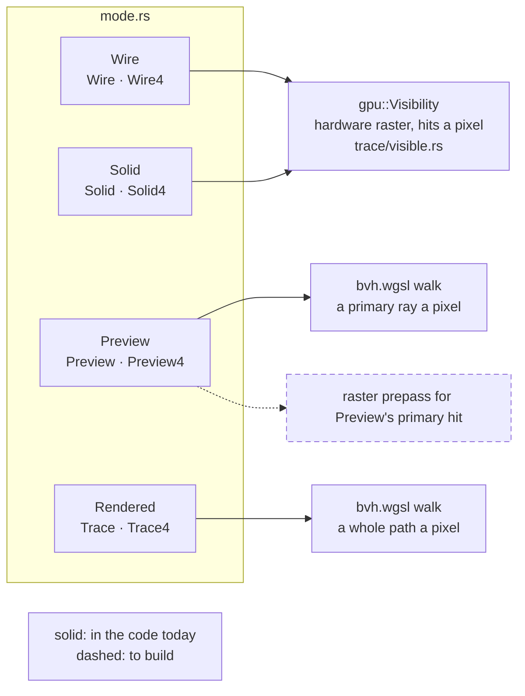
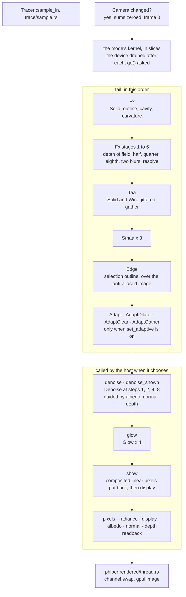
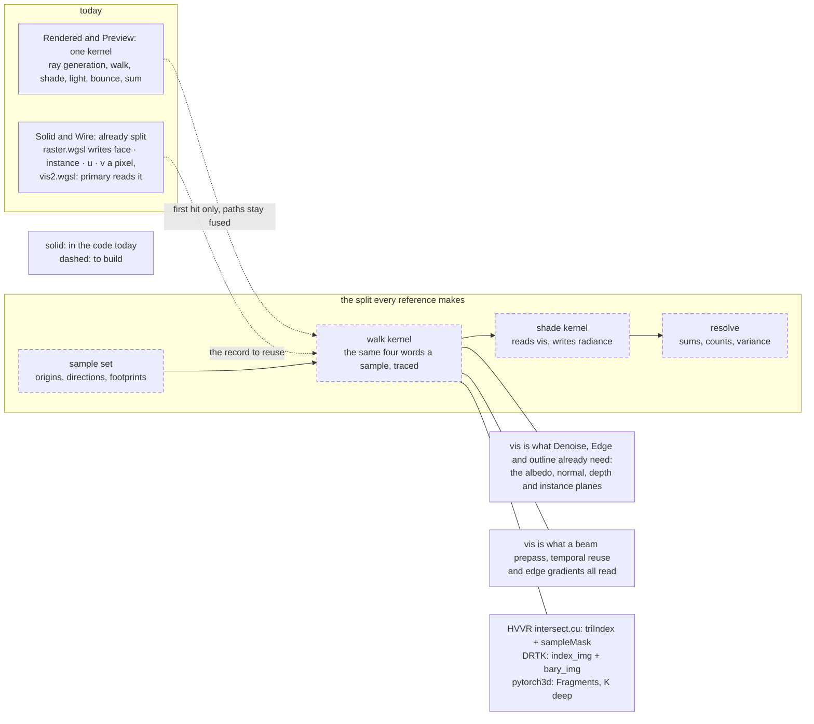

# frame

```mermaid
graph LR
    key["solid: in the code today<br/>dashed: to build"]
    subgraph modes["mode.rs"]
        m_wire["Wire<br/>Wire · Wire4"]
        m_solid["Solid<br/>Solid · Solid4"]
        m_preview["Preview<br/>Preview · Preview4"]
        m_rendered["Rendered<br/>Trace · Trace4"]
    end
    v_raster["gpu::Visibility<br/>hardware raster, hits a pixel<br/>trace/visible.rs"]
    v_walk["bvh.wgsl walk<br/>a primary ray a pixel"]
    v_path["bvh.wgsl walk<br/>a whole path a pixel"]
    m_wire --> v_raster
    m_solid --> v_raster
    m_preview --> v_walk
    m_rendered --> v_path
    v_pre["raster prepass for Preview's primary hit"]
    m_preview -.-> v_pre
    classDef plan stroke-dasharray: 6 4;
    class v_pre plan;
```

```mermaid
graph TB
    key["Tracer::sample_in, trace/sample.rs"]
    a_cam["Camera changed?<br/>yes: sums zeroed, frame 0"]
    a_slices["the mode's kernel, in slices<br/>the device drained after each, go() asked"]
    subgraph tail["tail, in this order"]
        t_fx["Fx<br/>Solid: outline, cavity, curvature"]
        t_dof["Fx stages 1 to 6<br/>depth of field: half, quarter, eighth, two blurs, resolve"]
        t_taa["Taa<br/>Solid and Wire: jittered gather"]
        t_smaa["Smaa x 3"]
        t_edge["Edge<br/>selection outline, over the anti-aliased image"]
        t_adapt["Adapt · AdaptDilate · AdaptClear · AdaptGather<br/>only when set_adaptive is on"]
    end
    subgraph after["called by the host when it chooses"]
        p_denoise["denoise · denoise_shown<br/>Denoise at steps 1, 2, 4, 8<br/>guided by albedo, normal, depth"]
        p_glow["glow<br/>Glow x 4"]
        p_show["show<br/>composited linear pixels put back, then display"]
        p_read["pixels · radiance · display · albedo · normal · depth<br/>readback"]
    end
    a_cam --> a_slices --> t_fx --> t_dof --> t_taa --> t_smaa --> t_edge --> t_adapt
    t_adapt --> p_denoise --> p_glow --> p_show --> p_read
    p_read --> host["phiber rendered/thread.rs<br/>channel swap, gpui image"]
```

```mermaid
graph LR
    key["solid: in the code today<br/>dashed: to build"]
    subgraph now["today"]
        n_trace["Rendered and Preview: one kernel<br/>ray generation, walk, shade, light, bounce, sum"]
        n_raster["Solid and Wire: already split<br/>raster.wgsl writes face · instance · u · v a pixel,<br/>vis2.wgsl: primary reads it"]
    end
    subgraph split["the split every reference makes"]
        x_gen["sample set<br/>origins, directions, footprints"]
        x_vis["walk kernel<br/>the same four words a sample, traced"]
        x_shade["shade kernel<br/>reads vis, writes radiance"]
        x_sum["resolve<br/>sums, counts, variance"]
    end
    n_trace -.->|"first hit only, paths stay fused"| x_vis
    n_raster -.->|"the record to reuse"| x_vis
    x_gen --> x_vis --> x_shade --> x_sum
    why1["vis is what Denoise, Edge and outline already need:<br/>the albedo, normal, depth and instance planes"]
    why2["vis is what a beam prepass, temporal reuse<br/>and edge gradients all read"]
    x_vis --- why1
    x_vis --- why2
    src["HVVR intersect.cu: triIndex + sampleMask<br/>DRTK: index_img + bary_img<br/>pytorch3d: Fragments, K deep"]
    x_vis --- src
    classDef plan stroke-dasharray: 6 4;
    class x_gen,x_vis,x_shade,x_sum plan;
```
