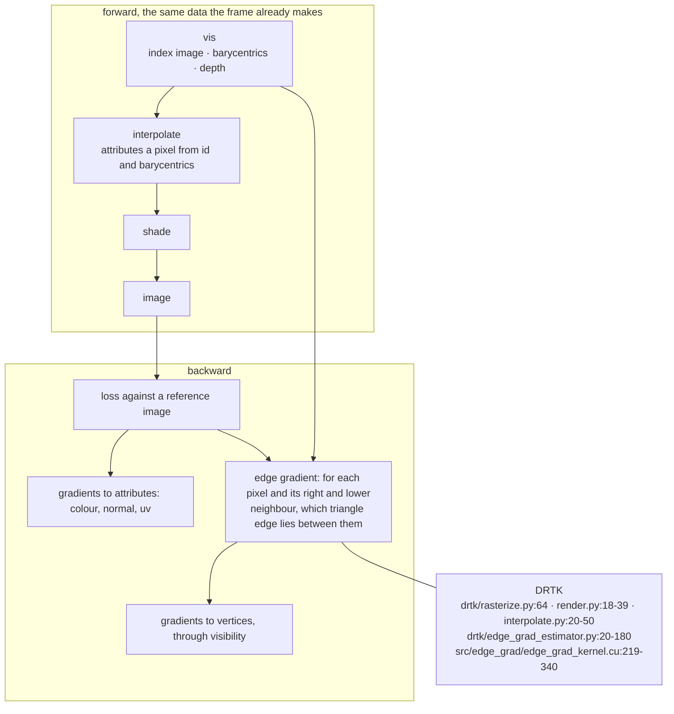
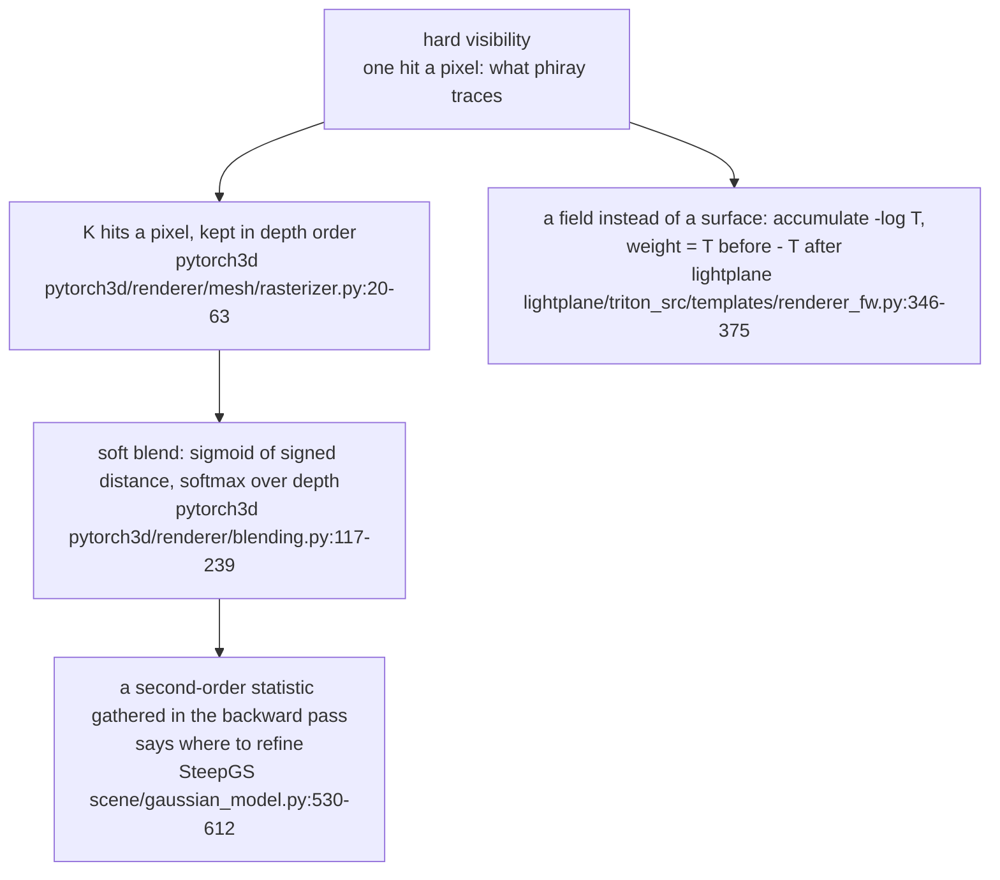
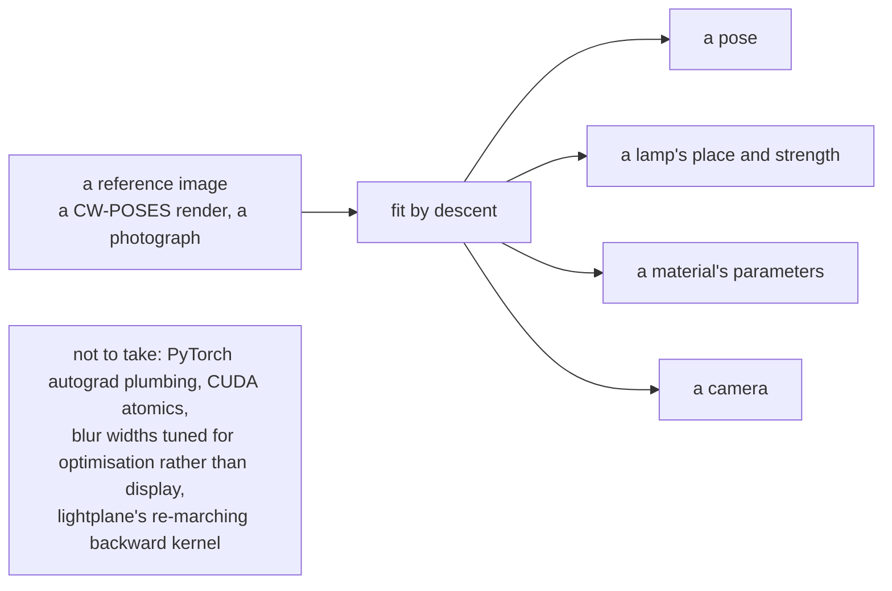

# gradient

Every box on this page is to build, and it is the last lane: it stands on
`vis`.

```mermaid
graph TB
    subgraph forward["forward, the same data the frame already makes"]
        f_vis["vis<br/>index image · barycentrics · depth"]
        f_interp["interpolate<br/>attributes a pixel from id and barycentrics"]
        f_shade["shade"]
        f_img["image"]
    end
    subgraph backward["backward"]
        b_loss["loss against a reference image"]
        b_edge["edge gradient: for each pixel and its right and lower<br/>neighbour, which triangle edge lies between them"]
        b_attr["gradients to attributes: colour, normal, uv"]
        b_geom["gradients to vertices, through visibility"]
    end
    f_vis --> f_interp --> f_shade --> f_img --> b_loss
    b_loss --> b_attr
    b_loss --> b_edge --> b_geom
    f_vis --> b_edge
    src["DRTK<br/>drtk/rasterize.py:64 · render.py:18-39 · interpolate.py:20-50<br/>drtk/edge_grad_estimator.py:20-180<br/>src/edge_grad/edge_grad_kernel.cu:219-340"]
    b_edge --- src
```

```mermaid
graph TB
    k_hard["hard visibility<br/>one hit a pixel: what phiray traces"]
    k_deep["K hits a pixel, kept in depth order<br/>pytorch3d pytorch3d/renderer/mesh/rasterizer.py:20-63"]
    k_soft["soft blend: sigmoid of signed distance, softmax over depth<br/>pytorch3d pytorch3d/renderer/blending.py:117-239"]
    k_field["a field instead of a surface: accumulate -log T,<br/>weight = T before - T after<br/>lightplane lightplane/triton_src/templates/renderer_fw.py:346-375"]
    k_stat["a second-order statistic gathered in the backward pass<br/>says where to refine<br/>SteepGS scene/gaussian_model.py:530-612"]
    k_hard --> k_deep --> k_soft
    k_hard --> k_field
    k_soft --> k_stat
```

```mermaid
graph LR
    u_ref["a reference image<br/>a CW-POSES render, a photograph"]
    u_fit["fit by descent"]
    u_pose["a pose"]
    u_lamp["a lamp's place and strength"]
    u_mat["a material's parameters"]
    u_cam["a camera"]
    u_ref --> u_fit
    u_fit --> u_pose
    u_fit --> u_lamp
    u_fit --> u_mat
    u_fit --> u_cam
    no["not to take: PyTorch autograd plumbing, CUDA atomics,<br/>blur widths tuned for optimisation rather than display,<br/>lightplane's re-marching backward kernel"]
```
