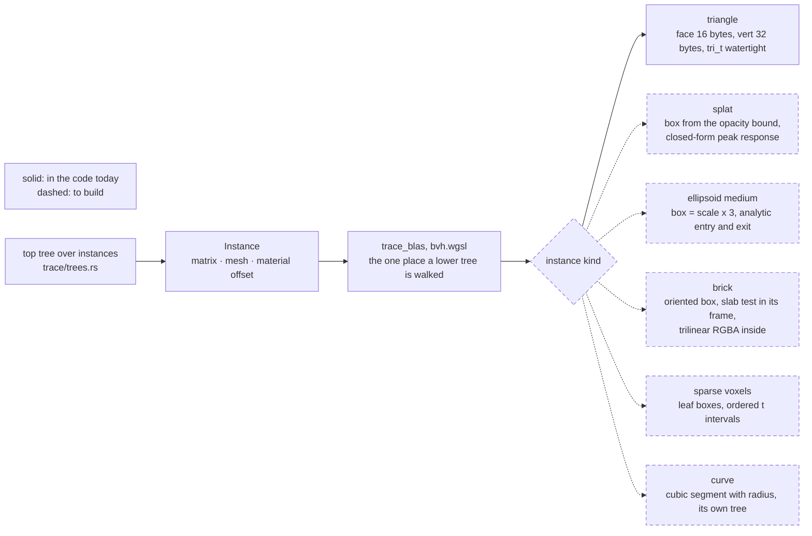
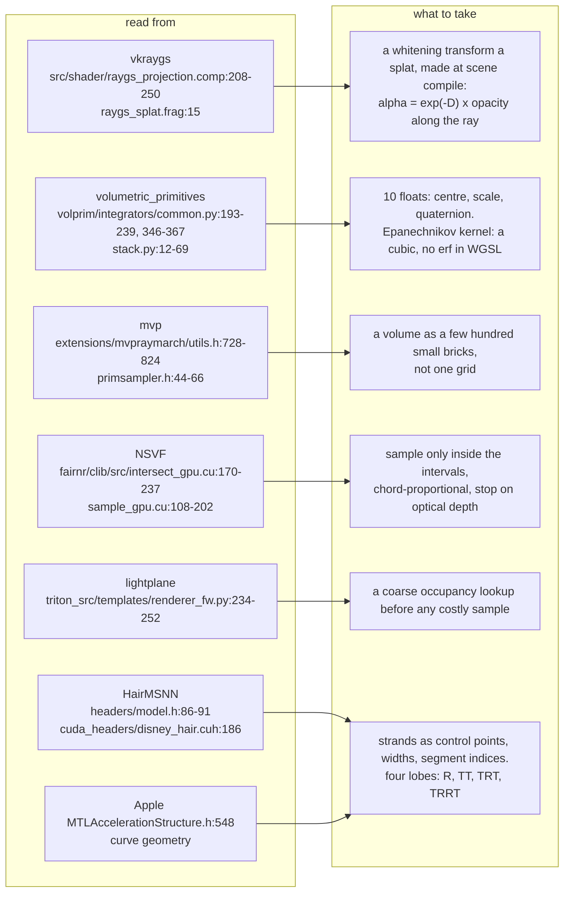
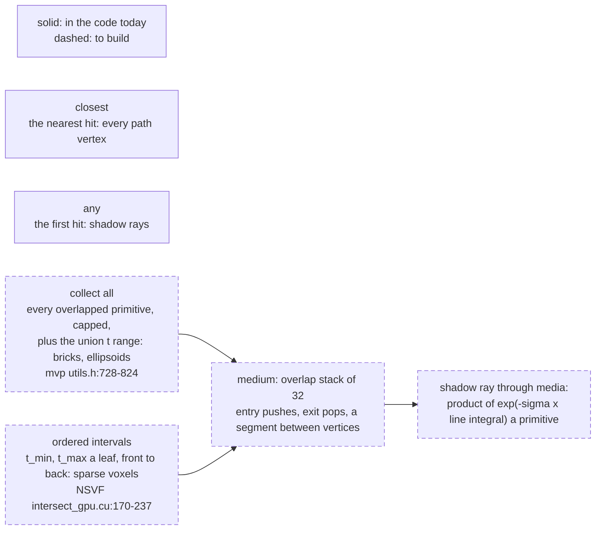
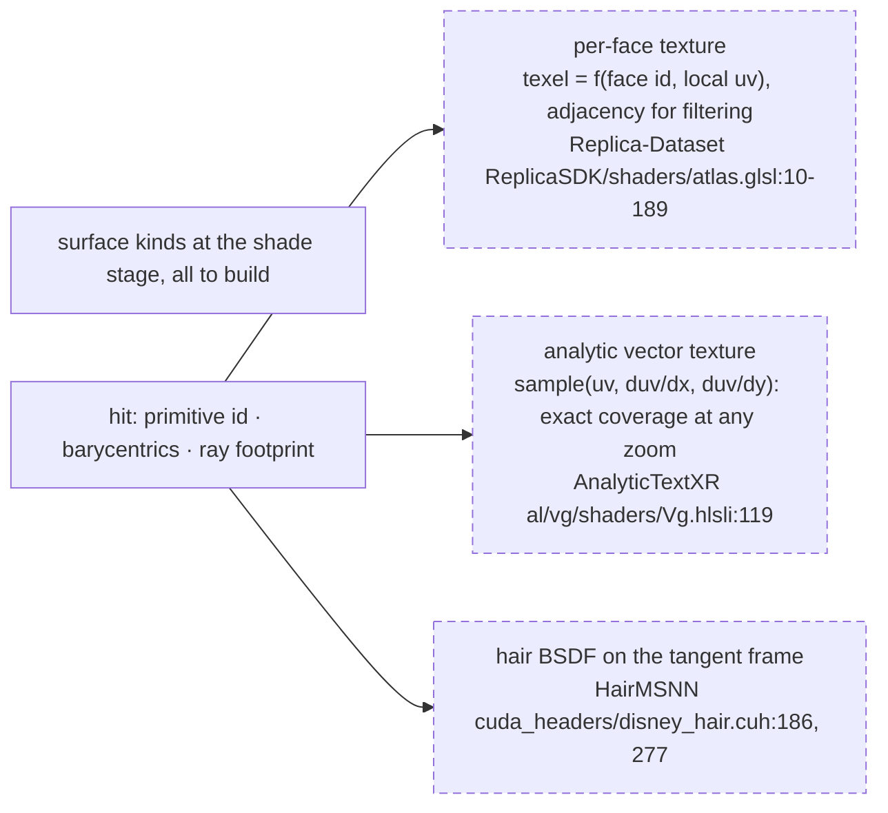

# primitives

```mermaid
graph LR
    key["solid: in the code today<br/>dashed: to build"]
    top["top tree over instances<br/>trace/trees.rs"]
    inst["Instance<br/>matrix · mesh · material offset"]
    seam["trace_blas, bvh.wgsl<br/>the one place a lower tree is walked"]
    kind{"instance kind"}
    top --> inst --> seam --> kind
    k_tri["triangle<br/>face 16 bytes, vert 32 bytes, tri_t watertight"]
    k_splat["splat<br/>box from the opacity bound,<br/>closed-form peak response"]
    k_ell["ellipsoid medium<br/>box = scale x 3, analytic entry and exit"]
    k_brick["brick<br/>oriented box, slab test in its frame,<br/>trilinear RGBA inside"]
    k_voxel["sparse voxels<br/>leaf boxes, ordered t intervals"]
    k_curve["curve<br/>cubic segment with radius, its own tree"]
    kind --> k_tri
    kind -.-> k_splat
    kind -.-> k_ell
    kind -.-> k_brick
    kind -.-> k_voxel
    kind -.-> k_curve
    classDef plan stroke-dasharray: 6 4;
    class kind,k_splat,k_ell,k_brick,k_voxel,k_curve plan;
```

```mermaid
graph LR
    subgraph src["read from"]
        r_vk["vkraygs<br/>src/shader/raygs_projection.comp:208-250<br/>raygs_splat.frag:15"]
        r_vp["volumetric_primitives<br/>volprim/integrators/common.py:193-239, 346-367<br/>stack.py:12-69"]
        r_mvp["mvp<br/>extensions/mvpraymarch/utils.h:728-824<br/>primsampler.h:44-66"]
        r_nsvf["NSVF<br/>fairnr/clib/src/intersect_gpu.cu:170-237<br/>sample_gpu.cu:108-202"]
        r_lp["lightplane<br/>triton_src/templates/renderer_fw.py:234-252"]
        r_hair["HairMSNN<br/>headers/model.h:86-91<br/>cuda_headers/disney_hair.cuh:186"]
        r_apple["Apple MTLAccelerationStructure.h:548<br/>curve geometry"]
    end
    subgraph take["what to take"]
        t_splat["a whitening transform a splat, made at scene compile:<br/>alpha = exp(-D) x opacity along the ray"]
        t_ell["10 floats: centre, scale, quaternion.<br/>Epanechnikov kernel: a cubic, no erf in WGSL"]
        t_brick["a volume as a few hundred small bricks,<br/>not one grid"]
        t_voxel["sample only inside the intervals,<br/>chord-proportional, stop on optical depth"]
        t_occ["a coarse occupancy lookup before any costly sample"]
        t_curve["strands as control points, widths, segment indices.<br/>four lobes: R, TT, TRT, TRRT"]
    end
    r_vk --> t_splat
    r_vp --> t_ell
    r_mvp --> t_brick
    r_nsvf --> t_voxel
    r_lp --> t_occ
    r_hair --> t_curve
    r_apple --> t_curve
```

```mermaid
graph LR
    key["solid: in the code today<br/>dashed: to build"]
    q_closest["closest<br/>the nearest hit: every path vertex"]
    q_any["any<br/>the first hit: shadow rays"]
    q_all["collect all<br/>every overlapped primitive, capped,<br/>plus the union t range: bricks, ellipsoids<br/>mvp utils.h:728-824"]
    q_order["ordered intervals<br/>t_min, t_max a leaf, front to back: sparse voxels<br/>NSVF intersect_gpu.cu:170-237"]
    m_stack["medium: overlap stack of 32<br/>entry pushes, exit pops, a segment between vertices"]
    m_tr["shadow ray through media:<br/>product of exp(-sigma x line integral) a primitive"]
    q_all --> m_stack --> m_tr
    q_order --> m_stack
    classDef plan stroke-dasharray: 6 4;
    class q_all,q_order,m_stack,m_tr plan;
```

```mermaid
graph LR
    key["surface kinds at the shade stage, all to build"]
    h_hit["hit: primitive id · barycentrics · ray footprint"]
    s_ptex["per-face texture<br/>texel = f(face id, local uv), adjacency for filtering<br/>Replica-Dataset ReplicaSDK/shaders/atlas.glsl:10-189"]
    s_text["analytic vector texture<br/>sample(uv, duv/dx, duv/dy): exact coverage at any zoom<br/>AnalyticTextXR al/vg/shaders/Vg.hlsli:119"]
    s_hair["hair BSDF on the tangent frame<br/>HairMSNN cuda_headers/disney_hair.cuh:186, 277"]
    h_hit --> s_ptex
    h_hit --> s_text
    h_hit --> s_hair
    classDef plan stroke-dasharray: 6 4;
    class s_ptex,s_text,s_hair plan;
```
