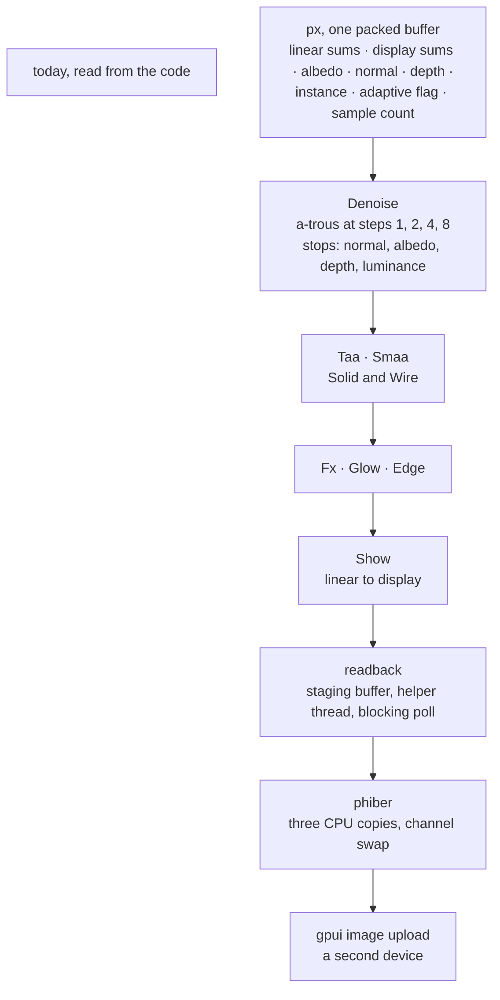
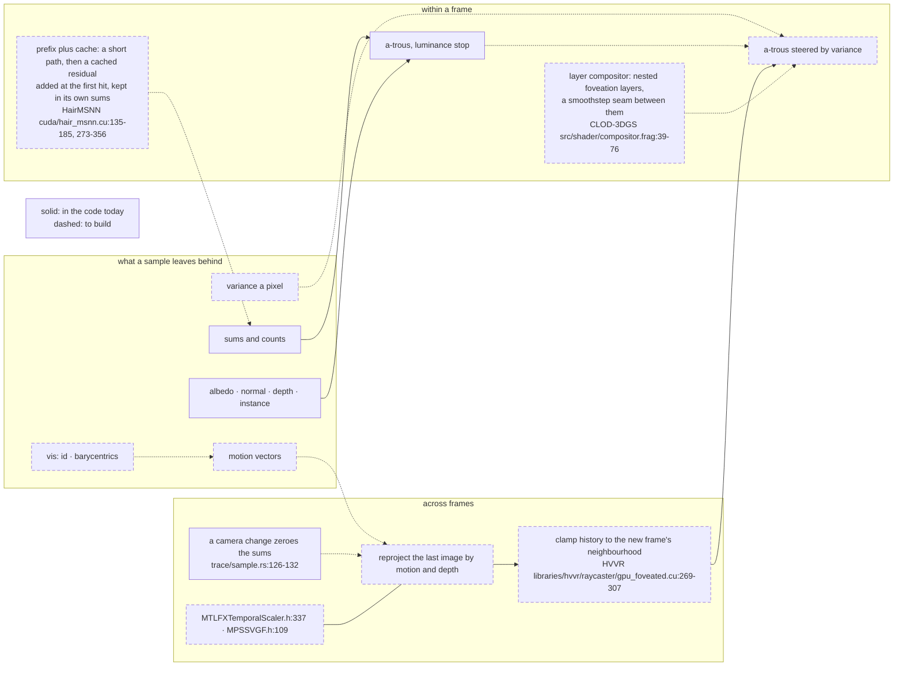
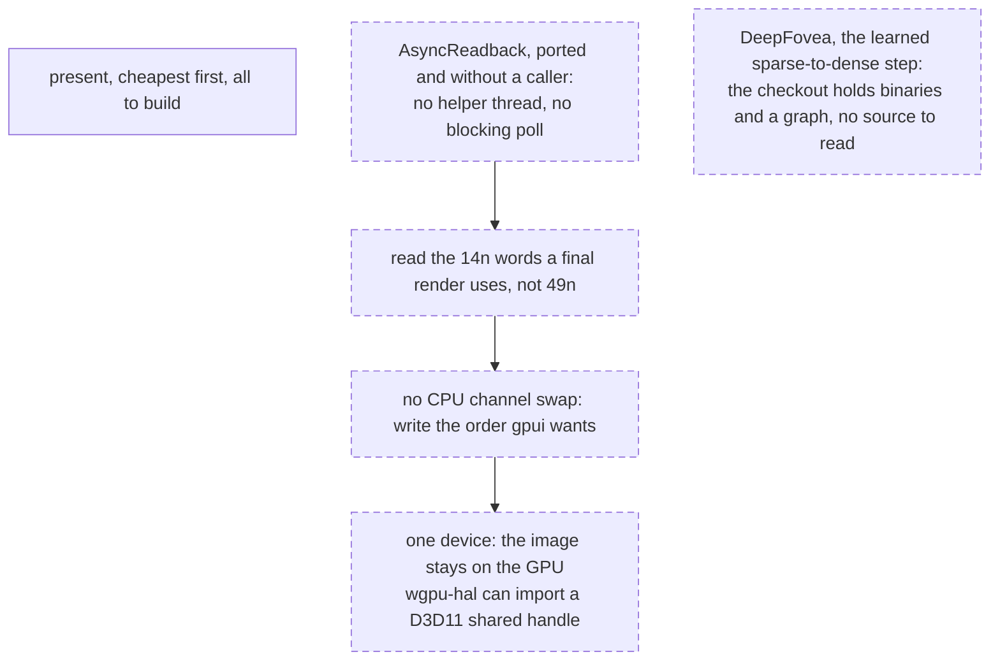

# reconstruct

```mermaid
graph TB
    key["today, read from the code"]
    r_px["px, one packed buffer<br/>linear sums · display sums · albedo · normal · depth ·<br/>instance · adaptive flag · sample count"]
    r_den["Denoise<br/>a-trous at steps 1, 2, 4, 8<br/>stops: normal, albedo, depth, luminance"]
    r_aa["Taa · Smaa<br/>Solid and Wire"]
    r_fx["Fx · Glow · Edge"]
    r_show["Show<br/>linear to display"]
    r_read["readback<br/>staging buffer, helper thread, blocking poll"]
    r_cpu["phiber<br/>three CPU copies, channel swap"]
    r_gpui["gpui image upload<br/>a second device"]
    r_px --> r_den --> r_aa --> r_fx --> r_show --> r_read --> r_cpu --> r_gpui
```

```mermaid
graph LR
    key["solid: in the code today<br/>dashed: to build"]
    subgraph inputs["what a sample leaves behind"]
        i_sum["sums and counts"]
        i_guides["albedo · normal · depth · instance"]
        i_var["variance a pixel"]
        i_motion["motion vectors"]
        i_vis["vis: id · barycentrics"]
    end
    subgraph time["across frames"]
        t_zero["a camera change zeroes the sums<br/>trace/sample.rs:126-132"]
        t_reproj["reproject the last image by motion and depth"]
        t_clamp["clamp history to the new frame's neighbourhood<br/>HVVR libraries/hvvr/raycaster/gpu_foveated.cu:269-307"]
        t_std["MTLFXTemporalScaler.h:337 · MPSSVGF.h:109"]
    end
    subgraph space["within a frame"]
        s_atrous["a-trous, luminance stop"]
        s_svgf["a-trous steered by variance"]
        s_layers["layer compositor: nested foveation layers,<br/>a smoothstep seam between them<br/>CLOD-3DGS src/shader/compositor.frag:39-76"]
        s_cache["prefix plus cache: a short path, then a cached residual<br/>added at the first hit, kept in its own sums<br/>HairMSNN cuda/hair_msnn.cu:135-185, 273-356"]
    end
    i_sum --> s_atrous
    i_guides --> s_atrous
    i_var -.-> s_svgf
    s_atrous -.-> s_svgf
    i_motion -.-> t_reproj
    t_zero -.-> t_reproj --> t_clamp --> s_svgf
    t_std --- t_reproj
    i_vis -.-> i_motion
    s_layers -.-> s_svgf
    s_cache -.-> i_sum
    classDef plan stroke-dasharray: 6 4;
    class i_var,i_motion,i_vis,t_reproj,t_clamp,t_std,s_svgf,s_layers,s_cache plan;
```

```mermaid
graph TB
    key["present, cheapest first, all to build"]
    p1["AsyncReadback, ported and without a caller:<br/>no helper thread, no blocking poll"]
    p2["read the 14n words a final render uses, not 49n"]
    p3["no CPU channel swap: write the order gpui wants"]
    p4["one device: the image stays on the GPU<br/>wgpu-hal can import a D3D11 shared handle"]
    p1 --> p2 --> p3 --> p4
    none["DeepFovea, the learned sparse-to-dense step:<br/>the checkout holds binaries and a graph, no source to read"]
    classDef plan stroke-dasharray: 6 4;
    class p1,p2,p3,p4,none plan;
```
