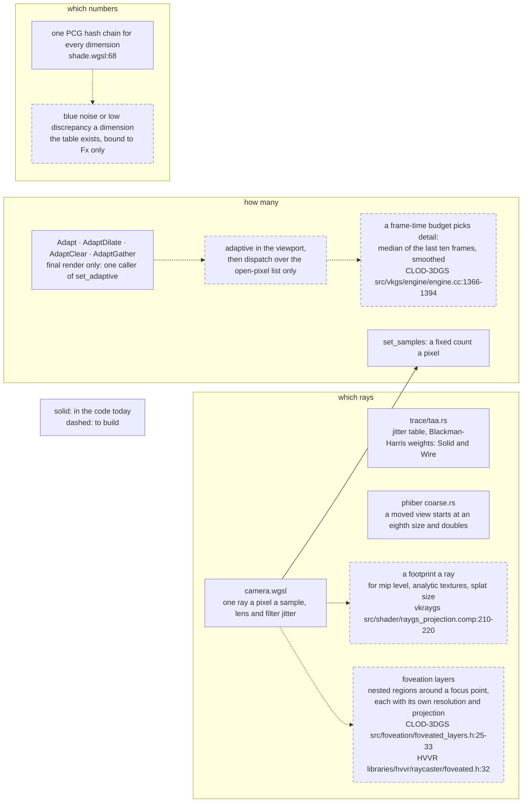
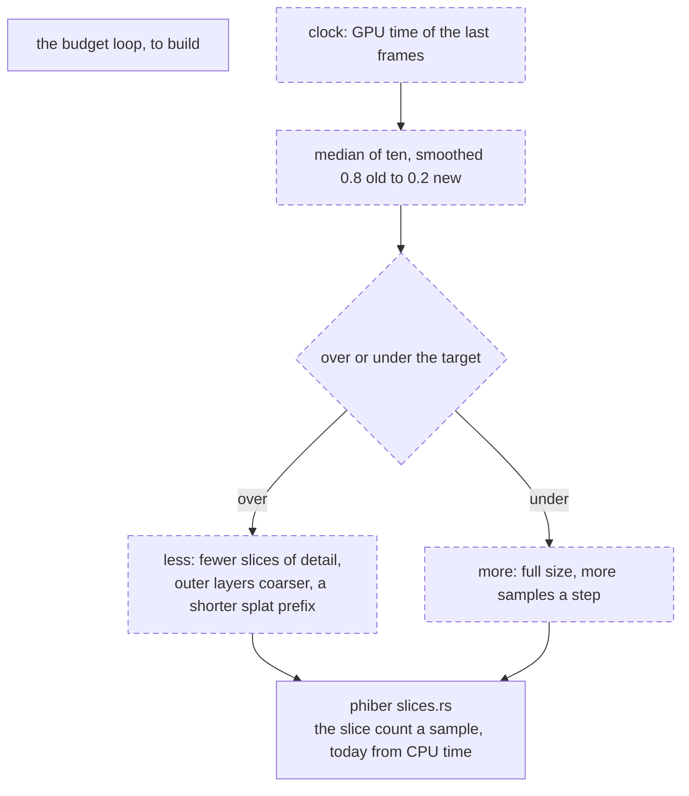
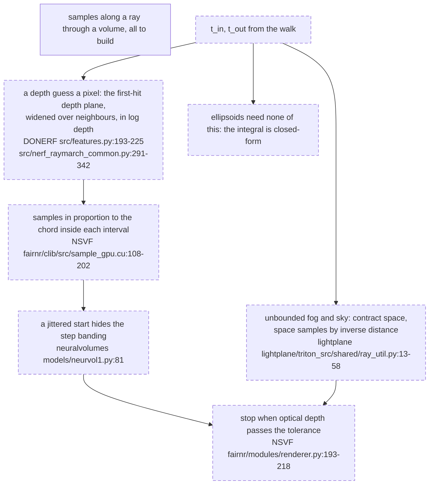

# sampling

```mermaid
graph LR
    key["solid: in the code today<br/>dashed: to build"]
    subgraph where["which rays"]
        w_cam["camera.wgsl<br/>one ray a pixel a sample, lens and filter jitter"]
        w_taa["trace/taa.rs<br/>jitter table, Blackman-Harris weights: Solid and Wire"]
        w_nav["phiber coarse.rs<br/>a moved view starts at an eighth size and doubles"]
        w_foot["a footprint a ray<br/>for mip level, analytic textures, splat size<br/>vkraygs src/shader/raygs_projection.comp:210-220"]
        w_fov["foveation layers<br/>nested regions around a focus point,<br/>each with its own resolution and projection<br/>CLOD-3DGS src/foveation/foveated_layers.h:25-33<br/>HVVR libraries/hvvr/raycaster/foveated.h:32"]
    end
    subgraph many["how many"]
        m_target["set_samples: a fixed count a pixel"]
        m_adapt["Adapt · AdaptDilate · AdaptClear · AdaptGather<br/>final render only: one caller of set_adaptive"]
        m_view["adaptive in the viewport,<br/>then dispatch over the open-pixel list only"]
        m_budget["a frame-time budget picks detail:<br/>median of the last ten frames, smoothed<br/>CLOD-3DGS src/vkgs/engine/engine.cc:1366-1394"]
    end
    subgraph numbers["which numbers"]
        n_pcg["one PCG hash chain for every dimension<br/>shade.wgsl:68"]
        n_blue["blue noise or low discrepancy a dimension<br/>the table exists, bound to Fx only"]
    end
    w_cam --> m_target
    w_cam -.-> w_foot
    w_cam -.-> w_fov
    m_adapt -.-> m_view
    m_view -.-> m_budget
    n_pcg -.-> n_blue
    classDef plan stroke-dasharray: 6 4;
    class w_foot,w_fov,m_view,m_budget,n_blue plan;
```

```mermaid
graph TB
    key["the budget loop, to build"]
    c_clock["clock: GPU time of the last frames"]
    c_med["median of ten, smoothed 0.8 old to 0.2 new"]
    c_pick{"over or under the target"}
    c_down["less: fewer slices of detail,<br/>outer layers coarser, a shorter splat prefix"]
    c_up["more: full size, more samples a step"]
    c_slice["phiber slices.rs<br/>the slice count a sample, today from CPU time"]
    c_clock --> c_med --> c_pick
    c_pick -->|over| c_down
    c_pick -->|under| c_up
    c_down --> c_slice
    c_up --> c_slice
    classDef plan stroke-dasharray: 6 4;
    class c_clock,c_med,c_pick,c_down,c_up plan;
```

```mermaid
graph TB
    key["samples along a ray through a volume, all to build"]
    v_in["t_in, t_out from the walk"]
    v_depth["a depth guess a pixel: the first-hit depth plane,<br/>widened over neighbours, in log depth<br/>DONERF src/features.py:193-225<br/>src/nerf_raymarch_common.py:291-342"]
    v_chord["samples in proportion to the chord inside each interval<br/>NSVF fairnr/clib/src/sample_gpu.cu:108-202"]
    v_jit["a jittered start hides the step banding<br/>neuralvolumes models/neurvol1.py:81"]
    v_far["unbounded fog and sky: contract space,<br/>space samples by inverse distance<br/>lightplane lightplane/triton_src/shared/ray_util.py:13-58"]
    v_stop["stop when optical depth passes the tolerance<br/>NSVF fairnr/modules/renderer.py:193-218"]
    v_closed["ellipsoids need none of this: the integral is closed-form"]
    v_in --> v_depth --> v_chord --> v_jit --> v_stop
    v_in --> v_far --> v_stop
    v_in --> v_closed
    classDef plan stroke-dasharray: 6 4;
    class v_in,v_depth,v_chord,v_jit,v_far,v_stop,v_closed plan;
```
